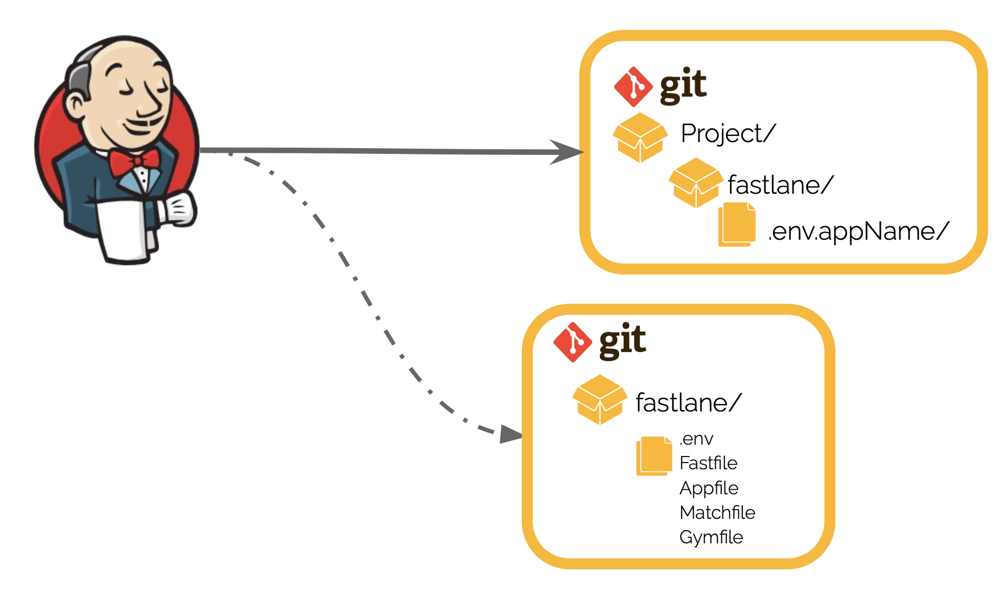

# Example template fastlane 

1. Сreate `fastlane` folder in the root of the project
2. Create [.env.appName](./ProjectFastlane/.env.appName) in `fastlane/`
3. Create git repository for your [fastlane-template](./CDCDFastlane)
4. Create your [.env](./CICDFastlane/.env) with your's key
5. Create pipeline for your application on CI
6. Add stage: clone repository with `fastlane-template` and copy fastlane's files to project's `fastlane`:
```
git clone git@repository.com/FastlaneCICD.git fastlane_temp

cp ./fastlane_temp/fastlane/* ./fastlane/
cp ./fastlane_temp/fastlane/.env fastlane/.env
```
8. You're great!
9. Use fastlane:
```
# fastlane ios <lane_name> --env appName
fastlane ios build --env appName
fastlane ios test --env appName
fastlane ios run_sonar --envName
fastlane ios deploy --envName
```

